# Overview
- [x] [Solve riddle on old *Monsters* Interface](#first-riddle) 
- [x] [Find metadata of Fire.mp4](#fire.mp4)
- [x] [Extract message from gifshuffle_talia_holds_the_key.gif](#main-gif)
- [x] [Extract image from 48-65-61-72-74-62-65-61-74.png](#48-65-61-72-74-62-65-61-74.png)
- [x] [Decrypt console output to view song lyrics](#presave-link)
# PHASE I
Twitter user @lost_boy84 [posted](https://twitter.com/lost_boy84/status/1531346528782237702) a burning heart emoji, the first tweet since 2020

Users viewed [website](https://183010165.com/) previously used for ARG.

It had been updated, showing a Unix interface. 

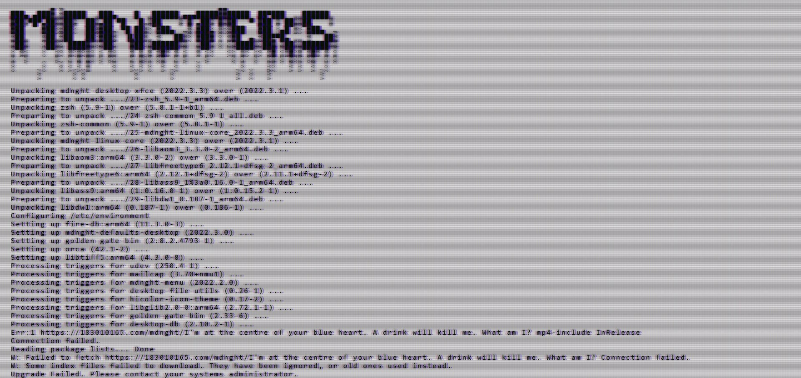

A riddle was provided
## First Riddle
One of the final lines of the page was a riddle

>https://183010165.com/mdnght/I'm at the centre of your blue heart. A drink will kill me. What am I? mp4-include InRelease

Unsure what 'blue heart' refers to, but 'a drink will kill me' refers to water putting a fire out, so fire is the answer

The solution was to add 'fire.mp4' to the clue URL (clueRL?)
>https://183010165/mdnght/fire.mp4

<video src="https://user-images.githubusercontent.com/6541033/171990189-6d677f2d-d14c-4028-9516-c934fd6151bc.mp4">
</video>

note: Is now at https://183010165.com/fire.mp4, not clear why it was moved

## fire.MP4
Opening fire.mp4 in a text editor reveals metadata (information about the file)
* Audio is `01_Golden Gate (Instrumental)_24bit_96kHz_Final_Master_3.18.22_LS_Edit.wav`
*  `heroes-bg-notext.png` is referenced

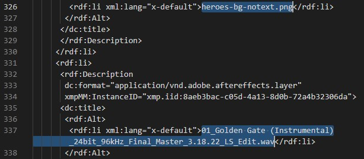

Golden Gate is a [song](https://www.youtube.com/watch?v=1UXLyW6N9LQ) by Tyler Lyle, and the audio in the video sounds like a synth cover of that. The Midnight has covered Lyles music before, with Brooklyn ([Lyle](https://www.youtube.com/watch?v=tg3YLGiDG9M), [The Midnight](https://www.youtube.com/watch?v=8Ey30-sYvuU)) and Lost & Found ([Lyle](https://www.youtube.com/watch?v=ZHhZPomMNlo), [The Midnight](https://www.youtube.com/watch?v=vDNG5AkNfcs))

heroes-bg-notext.png is not a known reference like this

# Phase II - June 1 2022 #
The old website has an update available. 

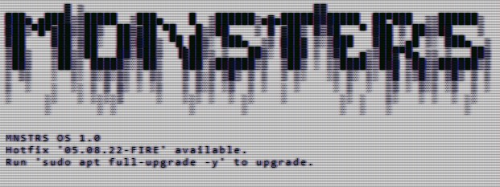

*This command is similar to the update command on Linux systems, `sudo apt-get update`, as a fun aside*

Running the command takes you to [a new website](comtek.life) advertising an unknown upcoming release by The Midnight

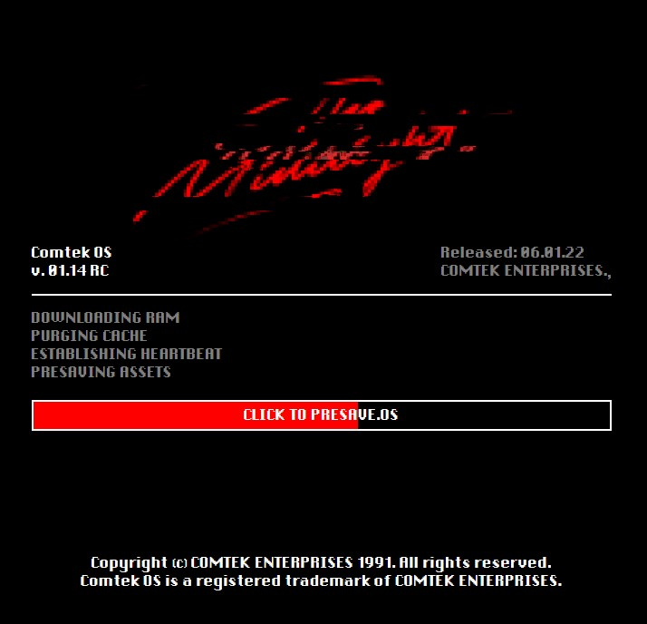

Several things were found in here
## Comtek Homepage Info
### Main Gif
The gif on the page is seen glitching stylistically

Using the 'inspect element' feature of the browser, the name of this gif can be seen as `gifshuffle_talian_holds_the_key.gif`

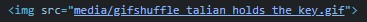

Talian here is a reference to Discord user Talian, who was the first to find the metadata in fire.mp4 and alert the chat

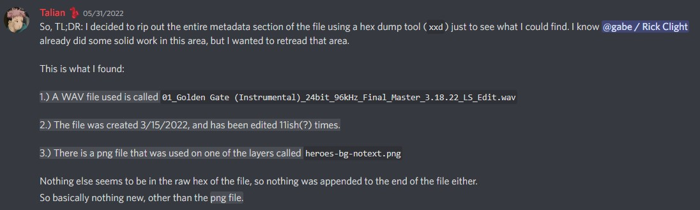

Gifshuffle is the name of a command line utility, included in Ubuntu (more info [here](http://manpages.ubuntu.com/manpages/bionic/man1/gifshuffle.1.html)). Gifshuffle is used to hide messages in gif files, and the inclusion of it in the name here suggests it needs to be used to extract the message.

Part of the metadata is 'heroes-bg-notext.png', which seems unrelated to anything seen so far.

Running the command
`gifshuffle -C -p "heroes-bg-notext.png" gifshuffle_talian_holds_the_key.gif` (you need to download the file from the website, then run this command in the same directory as where it is saved) reveals the hidden message
>/heroes/48-65-61-72-74-62-65-61-74.png

Adding this to the comtek.life [URL](comtek.life//heroes/48-65-61-72-74-62-65-61-74.png) provides you with an image

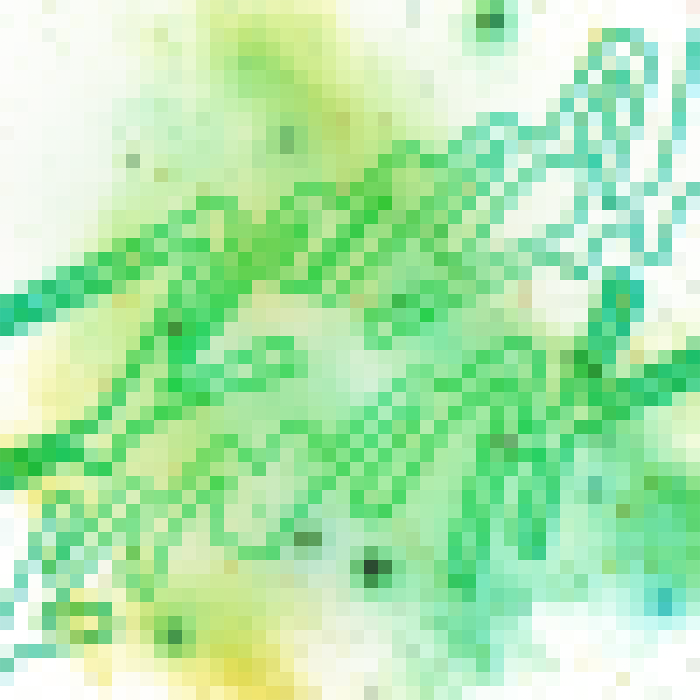</img>

### 48-65-61-72-74-62-65-61-74.png
By inverting the colours on this image and rotating 180 degrees, it becomes slightly more legible, and 'heart beat' can be slightly made out

</img>

The name, 48-65-61-72-74-62-65-61-74, is also a hexadecmial string that translates to 'heartbeat'

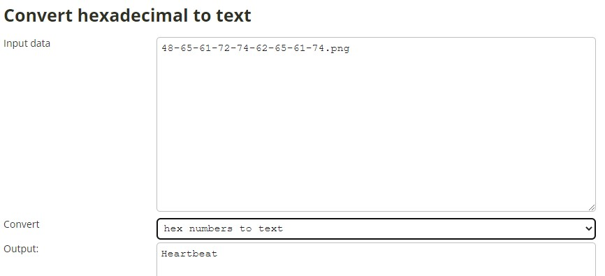

The LostBoy account tweeted a hint that something was yet to be discovered

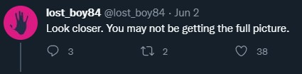

Tyler Lyle tweeted a clue out to assist in the next step of this clue

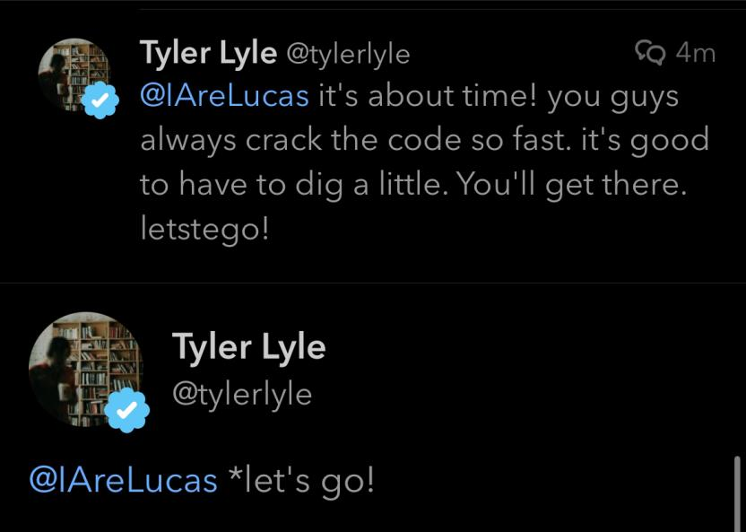

The use of 'stego' here is a hint at 'steganography', the process of hiding content within other content, much like the Gifshuffle tool earlier. 

[OpenStego](https://www.openstego.com/) is a free tool available to extract data hidden in images, but it needs a password. The text in the image, as well as the filename, are both 'heartbeat' which is worth trying

OPENSTEGO IMAGE

This succeeds, and reveals the hidden image; a full resolution copy of the 'Heartbeat' image 

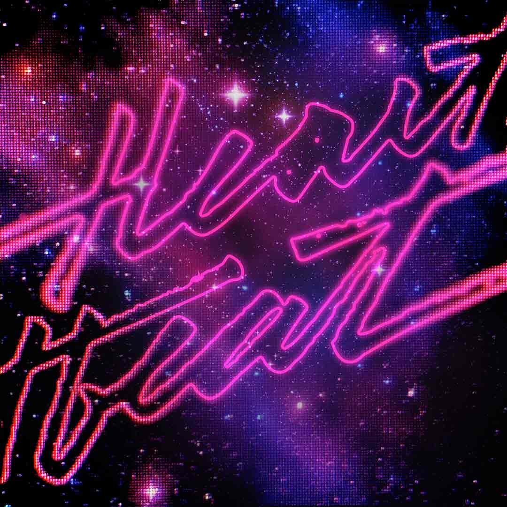</img>

LostBoy then replies to their earlier tweet, confirming this was solved

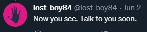

### Presave Link
By clicking the Presave bar in the middle of the screen, a long string is output to the browser console. This can be viewed through inspect element
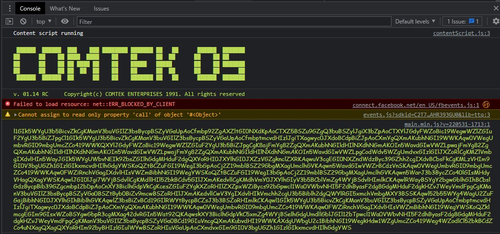

The text of this is
> l1GIk5WYgU3b5BicvZkCgKManV3buVGIlZ3bsBycpBSZyVGaUpAoCfmbp92ZgAXZltGI0NXdKpAoCTXZ5BSZu9GZgQ3buBSZylJgiX3bZpAoCTXYlJGdyFWZoBic19WegwWZlZGIuF2YgU3b5BiZJpgCl1GIk5WYgU3b5BicvZkCgKManV3buVGIlZ3bsBycpBSZyVGaUpAoCfmbptmcvdHIzlJgiTXagwyc0JXdoBCdpBiZJpAoCXmYgQXmAKubhNGI19WWKAqw0VWegUmbvRGI09mbgUmcZCo419WWKQXYlJGdyFWZoBic19WegwWZlZGIuF2YgU3b5BiZJpgCgK8ajFmYg82ZgQXmAKubhNGIldHIlNXdhNGmAKOIn5WavdGIwVWZLpwajFmYg82ZgQXmAKubhNGIldHIlNXdhNGmAKOIn5WavdGIwVWZLpwajFmYg82ZgQXmAKubhNGIldHIlNXdhNGmAKOIn5WavdGIwVWZLpgCodWdv5WZgUmdvxGIzlGIlJXZoRlCgKMZlVmbgIXdvlHIn5WayJGIk5WYgUWbvNEIk92bsZGIlhGdgMHduF2dgQXYoRHI0JXYlhGI0JXZzVGZgknclZXRKAqwuV3cgEGI0NXZndWdzByc39GZhh2cgIXdvBCbsFkCgKMLzVHIm9GI0V3bgUGZh1GIzlGIkxmcvdHIlhGdgYWSKoQZtBCZuFGI19WegI3bGpAoCj2Z19mblBSZ29GbgMXagUmclhGVKAqwn5WavdGIwVWZrBCdzVnSKAqw0VWegUmbvRGI09mbgUmcZCo419WWKAqw0FWZiRnchVGagIXdvlHIsVWZmBibhNGI19WegYWSKoQZtBCZuFGI19WegI3bGpAoCj2Z19mblBSZ29GbgMXagUmclhGVKAqwn5WarJ3b3BycZCo40lGIsMHdyVHagQXagYWSKAqwlJGI0lJgi7WYjBSdvllCgKMdllHIl52bkBCdv5GIlJXmAKedvllCgKMdhVmY0JXYlhGIyV3b5BCblVmZg4WYjBSdvlHImlkCKAqwlRWayBSYgY2bgwGblhGIhBCbslGdzBycpBib39GZgcmbp12bDpAoCnXY3BiclhGdpVkCgKcesZGIuF2YgkXZoRHIlZXZpxWZiBycs92bGpwcl1Wa0VWbvNHI5F2dhByasF2dg8GdgMHduF2dgkHZvJWeyVmdFpgCgKManV3buVGIlZ3bsBycpBSZyVGa0BSZtByb0BiZv9mcwBSZoRHIlJXmAKedvllCwV3YgIXdvlHIkVmchh2cgU3b5Biblh2dgQWYlRGI5xmchVmbgMXY3BSSKAqwl52b55WYg4WagU2ZuFGajBibhNGI0JXYlhGIhBiblhGVKAqwlZ3bsBiZvBCd19GIlRWYtBycpBCZsJ3b3BSZoRHImlkCKAqwl1GIk5WYgU3b5BicvZkCgKManV3buVGIlZ3bsBycpBSZyVGaUpAoCfmbptmcvdHIzlJgiTXagwyc0JXdoBCdpBiZJpAoCXmYgQXmAKubhNGI19WWKAqw0VWegUmbvRGI09mbgUmcZCo419WWKAqw0FWZiRnchVGagIXdvlHIsVWZmBibhNGI19WegYWSKoQZklmcgEGIm9GIsxWZoBSYgwGbpR3cgMXag42dvRGIn5Wat92QKAqwskXY3BiclhGdpVkC5xmZg4WYjBSelhGdgUmdllGblJGIl12bTpwcl1Wa0VWbvNHI5F2dhByasF2dg8GdgMHduF2dgkHZvJWeyVmdFpgCgKManV3buVGIlZ3bsBycpBSZyVGa0BCd19GIuVncgQXmAKubvdHI19WWKAXdgUWbgU2c1BibhNGI19WegkHdw1WZgUmcZCo419Weg4WZodlCl52bkBCdZCo4uNXagQXagQXYoRHIm92byBHIzlGIulWYwBSZoRHIuVGaUpAoCXmdvxGIm9GI0V3bgUGZh1GIzlGIkxmcvdHIlhGdgYWS

This text can be reversed, and decoded as Base64 ([online tools](https://www.base64decode.org/) can do this)

Decoding the text reveals song lyrics

>If the world is made out of love\
>Then the pain is proof that it isn’t done\
>When you’re empty you can use me up\
>You won’t run out there is love enough

>Everybody wants to walk away sometimes\
>Some believe they can fly\
>Either way,\
>Coming down is still a hell of a ride

>If you can feel your heartbeat\
>You’re not done yet\
>You can’t be\
>If it hurts, it’s working\
>There is love enough\
>For you and me

>If the world is made out of love\
>Then a heart can change in anyone\
>I was nearly dead when you shared your cup\
>You’re the proof to me there is love enough

>Everybody wants to walk away sometimes\
>Fools believe they can fly\
>Either way\
>Coming down is still a hell of a ride

>If you can feel your heartbeat\
>You’re not done yet\
>You can’t be\
>If it hurts, it’s working\
>There is love enough\
>For you and me

>If you can feel your heartbeat\
>You’re not done yet\
>Just keep going\
>There is love enough\
>For you and me

>If the world is made out of us,\
>All our shadows suggest a sun\
>Every desert heart that wants the flood\
>Come and bring your need\
>There is love enough

>Keep going ‘cause we can’t go back\
>Keep going ‘cause we can’t go back\
>Keep going ‘cause we can’t go back\

>If you can feel your heartbeat\
>You’re not done yet\
>You can’t be\
>If it hurts, it’s working\
>There is love enough\
>For you and me

>If you can feel your heartbeat\
>You’re not done yet\
>Just keep going\
>There is love enough\
>For you and me
